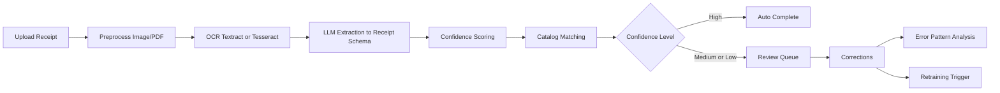

# Receipt Intelligence Pipeline
Production-grade OCR + LLM receipt understanding service with confidence routing, active learning, error analysis, and retraining workflows.

## What this project does
- Extracts structured receipt data from image/PDF uploads
- Uses AWS Textract as primary OCR with Tesseract fallback
- Runs schema-constrained extraction with GPT-4o + Instructor
- Computes composite confidence and routes uncertain outputs to review
- Matches line items to a canonical product catalog (fuzzy + embeddings)
- Captures human corrections and feeds error analysis/retraining
- Exposes analytics, calibration, cost, and metrics endpoints

## Architecture

## Implemented scope (Day 1-3)
- FastAPI app with lifespan startup/shutdown
- Async SQLAlchemy models for receipts, line items, review queue, error patterns, retraining runs, and product catalog
- Full endpoint groups from spec:
  - `receipts`, `review`, `catalog`, `analytics`, `retrain`, `health`, `metrics`
- Celery worker + beat jobs:
  - nightly error analysis
  - monthly scheduled retraining
- PDF first-page preprocessing and image enhancement pipeline
- Weak supervision retraining artifact generation + optional W&B logging

## Quick start
1. Copy environment template:
   - `cp .env.example .env`
2. Set required secrets in `.env`:
   - `OPENAI_API_KEY`
   - `AWS_ACCESS_KEY_ID` and `AWS_SECRET_ACCESS_KEY` (optional if relying on Tesseract fallback)
3. Start services:
   - `docker compose up --build`
4. Open API docs:
   - `http://localhost:8000/docs`

## Core API groups
- `POST /receipts/upload`, `POST /receipts/batch`, `GET /receipts/*`
- `GET /review/queue`, `GET /review/{id}`, `POST /review/{id}/correct|approve|skip`
- `GET/POST /catalog/*` including `/catalog/match` and `/catalog/embed`
- `GET /analytics/errors|accuracy|confidence|cost`, `POST /analytics/analyze`
- `POST /retrain/trigger`, `GET /retrain/runs`, `GET /retrain/runs/{id}`
- `GET /health`, `GET /metrics`

## Benchmarking (CORD)
Run CORD evaluation and produce JSON:
- `python benchmarks/run_cord.py --split test --limit 100`

Generate README-ready markdown report from the latest JSON:
- `python benchmarks/report.py`

Or specify explicit files:
- `python benchmarks/report.py --input benchmarks/results/cord_test_<timestamp>.json --output benchmarks/results/cord_report.md`

## Testing and validation
- `python -m compileall app tests benchmarks`
- `pytest tests/test_ocr.py tests/test_extraction.py tests/test_confidence.py tests/test_matching.py tests/test_api.py`

## Notes
- All configuration is environment-driven (`.env`, `.env.example`).
- Prometheus metrics are available at `/metrics`.
- Uploaded files are stored under `uploads/` by default.
