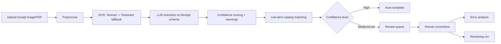

# Receipt Intelligence Pipeline
[](https://github.com/theSelfSa/receipt-intelligence-pipeline/actions/workflows/ci.yml)
[](LICENSE)
[](https://www.python.org/)
[](https://fastapi.tiangolo.com/)
[](https://www.postgresql.org/)
[](https://redis.io/)

End-to-end OCR + LLM platform for turning messy receipt images/PDFs into structured, reviewable, and continuously improving financial data.

## Why this project
Receipt extraction fails in real-world conditions: noisy scans, inconsistent layouts, ambiguous totals, and vendor-specific line-item formats.  
This pipeline addresses that with:
- resilient OCR (Textract primary + Tesseract fallback)
- schema-constrained extraction into typed receipt objects
- confidence-based routing to human review
- catalog normalization (fuzzy + vector matching)
- feedback loops for error analysis and retraining runs

## Pipeline architecture


## Core capabilities
- **Asynchronous ingestion** with Celery workers (`/receipts/upload`, `/receipts/batch`)
- **Typed extraction** via Pydantic schema (`Receipt`, `LineItem`, parse warnings, confidence levels)
- **Human-in-the-loop review** with correction/approve/skip workflows
- **Product normalization** using rapidfuzz first, embeddings fallback (pgvector)
- **Analytics APIs** for error patterns, calibration, estimated accuracy, and cost summary
- **Scheduled learning loop** with nightly error analysis and monthly retraining tasks
- **Benchmark suite** for CORD dataset with OpenAI, Groq, or local heuristic extraction

## Quick start
### 1) Configure environment
Copy `.env.example` to `.env` and set values:
- Required for LLM extraction: `OPENAI_API_KEY` or `GROQ_API_KEY`
- Optional for cloud OCR: `AWS_ACCESS_KEY_ID`, `AWS_SECRET_ACCESS_KEY`, `AWS_REGION`
- For local OCR on Windows, you can set `TESSERACT_CMD` if Tesseract is not in PATH

### 2) Run with Docker Compose
```bash
docker compose up --build
```

### 3) Seed sample product catalog (recommended)
```bash
python -m app.scripts.seed_catalog --csv data/sample_products.csv
```

### 4) Open API docs
- Swagger UI: `http://localhost:8000/docs`
- Health check: `http://localhost:8000/health`

## Local development (without Docker)
```bash
pip install -r requirements.txt
uvicorn app.main:app --reload
```

In separate terminals:
```bash
celery -A app.worker.celery_app worker --loglevel=info
celery -A app.worker.celery_app beat --loglevel=info
```

## API overview
### Receipt pipeline
- `POST /receipts/upload`
- `POST /receipts/batch`
- `GET /receipts/batch/{job_id}`
- `GET /receipts/{receipt_id}`
- `GET /receipts/{receipt_id}/image`
- `GET /receipts/{receipt_id}/ocr`
- `GET /receipts/`
- `GET /receipts/stats`

### Review operations
- `GET /review/queue`
- `GET /review/{review_id}`
- `POST /review/{review_id}/correct`
- `POST /review/{review_id}/approve`
- `POST /review/{review_id}/skip`
- `GET /review/stats`

### Catalog, analytics, retraining
- `GET /catalog/products`, `POST /catalog/products`, `GET /catalog/search`
- `POST /catalog/match`, `POST /catalog/embed`
- `GET /analytics/errors`, `POST /analytics/analyze`
- `GET /analytics/accuracy`, `GET /analytics/confidence`, `GET /analytics/cost`
- `POST /retrain/trigger`, `GET /retrain/runs`, `GET /retrain/runs/{run_id}`

### System
- `GET /health` (database + redis status)
- `GET /metrics` (Prometheus metrics)

## Benchmarking (CORD v2)
`benchmarks/run_cord.py` supports three extraction backends:
- `heuristic` → local/no API cost
- `openai` → OpenAI structured extraction
- `groq` → Groq OpenAI-compatible structured extraction

Example commands:
```bash
python benchmarks/run_cord.py --split test --limit 100 --extraction-mode heuristic
python benchmarks/run_cord.py --split test --limit 100 --extraction-mode openai
python benchmarks/run_cord.py --split test --limit 100 --extraction-mode groq
```

Generate report markdown from benchmark JSON:
```bash
python benchmarks/report.py
python benchmarks/report.py --input benchmarks/results/cord_test_<timestamp>.json --output benchmarks/results/cord_report.md
```

### Latest tuned Groq snapshot (50 CORD samples)
Source: `benchmarks/results/cord_test_20260524_234250.json`
- Success: **45/50** (`90%`)
- Total exact match: **44.4%**
- Line-item price exact match: **34.4%**
- Line-item name fuzzy match: **36.7%**
- Avg latency: **23.73s** (p95: **48.38s**)

## Quality and CI
Local checks:
```bash
python -m compileall app tests benchmarks
python -m pytest tests -q
```

CI workflow (`.github/workflows/ci.yml`) runs compile checks and the test suite on push/PR to `main`.

## Project layout
```text
app/
  main.py
  worker.py
  routers/
  services/
  models/
  scripts/
benchmarks/
  run_cord.py
  report.py
tests/
docker-compose.yml
requirements.txt
```

## License
MIT License. See `LICENSE`.
