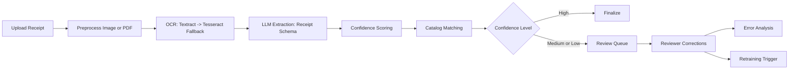

# Receipt Intelligence Pipeline
Production-grade OCR + LLM pipeline for extracting structured receipt data, routing uncertain predictions to review, and continuously improving extraction quality through active-learning feedback loops.

## Overview
This project combines document OCR, schema-constrained LLM extraction, confidence calibration, catalog matching, and retraining workflows into a single service-oriented platform. It is designed for real-world receipt ingestion where scan quality and receipt formats vary significantly.

## Core capabilities
- OCR with **AWS Textract** (primary) and **Tesseract** fallback
- Typed extraction using **GPT-4o + Instructor** with strict Pydantic models
- Composite confidence scoring with automated routing:
  - high confidence: auto-complete
  - medium/low confidence: review queue
- Product normalization with fuzzy + embedding-based matching
- Human correction capture and error pattern analytics
- Scheduled and manual retraining pipeline with run tracking
- Benchmark tooling for CORD dataset evaluation and reporting

## Architecture

## Tech stack
- **API**: FastAPI, Pydantic v2, async SQLAlchemy
- **Queueing**: Celery + Redis
- **Database**: PostgreSQL + pgvector
- **OCR/LLM**: AWS Textract, pytesseract, OpenAI, Instructor
- **Matching & analytics**: rapidfuzz, embeddings, pandas
- **Observability**: structlog, Prometheus `/metrics`
- **Testing**: pytest, pytest-asyncio, httpx

## Project structure
- `app/main.py`: FastAPI app and lifecycle wiring
- `app/routers/`: API route groups (`receipts`, `review`, `catalog`, `analytics`, `retrain`)
- `app/services/`: OCR, extraction, confidence, matching, error analysis, retraining
- `app/models/`: DB ORM models and API schemas
- `app/worker.py`: Celery tasks + scheduled jobs
- `benchmarks/`: CORD evaluation and report generation scripts
- `tests/`: unit/integration-oriented test modules

## Quick start
### 1) Configure environment
Copy `.env.example` to `.env` and set required values:
- `OPENAI_API_KEY` or `GROQ_API_KEY`
- `AWS_ACCESS_KEY_ID` / `AWS_SECRET_ACCESS_KEY` (optional if using fallback OCR only)

### 2) Run with Docker Compose
`docker compose up --build`
### 3) Seed sample product catalog (recommended)
`python -m app.scripts.seed_catalog --csv data/sample_products.csv`

### 4) Open API docs
`http://localhost:8000/docs`

## API surface
### Receipt processing
- `POST /receipts/upload`
- `POST /receipts/batch`
- `GET /receipts/{id}`
- `GET /receipts/{id}/image`
- `GET /receipts/{id}/ocr`
- `GET /receipts/`
- `GET /receipts/stats`

### Human review
- `GET /review/queue`
- `GET /review/{id}`
- `POST /review/{id}/correct`
- `POST /review/{id}/approve`
- `POST /review/{id}/skip`
- `GET /review/stats`

### Catalog / analytics / retraining
- `GET|POST /catalog/*`
- `GET|POST /analytics/*`
- `POST /retrain/trigger`
- `GET /retrain/runs`
- `GET /retrain/runs/{id}`

### System
- `GET /health`
- `GET /metrics`

`/health` reports both database and Redis status.

## Testing and quality checks
- `python -m compileall app tests benchmarks`
- `python -m pytest tests`

## Continuous Integration
GitHub Actions workflow runs on push/PR and executes:
- dependency installation
- compile checks (`python -m compileall app tests benchmarks`)
- full test suite (`python -m pytest tests`)

## Benchmarking (CORD)
Run CORD benchmark with local no-cost heuristic extraction:
- `python benchmarks/run_cord.py --split test --limit 100 --extraction-mode heuristic`

Run CORD benchmark with OpenAI extraction (paid API usage):
- `python benchmarks/run_cord.py --split test --limit 100 --extraction-mode openai`

Run CORD benchmark with Groq extraction:
- `python benchmarks/run_cord.py --split test --limit 100 --extraction-mode groq`

Notes:
- CORD samples are downloaded automatically from Hugging Face.
- Local OCR requires Tesseract to be installed.
- OpenAI mode requires `OPENAI_API_KEY`.
- Groq mode requires `GROQ_API_KEY`.

Generate markdown report from latest benchmark JSON:
- `python benchmarks/report.py`

Generate report from explicit file:
- `python benchmarks/report.py --input benchmarks/results/cord_test_<timestamp>.json --output benchmarks/results/cord_report.md`

## License
This project is licensed under the **MIT License**. See `LICENSE`.
